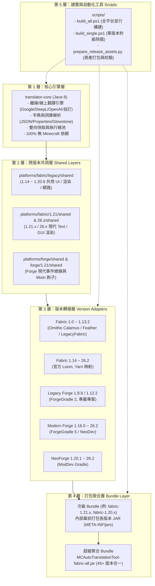

# 專案架構設計全景手冊 (Project Architecture Guide)

本文件完整說明 `mc-auto-translation-tool`（MC 自動翻譯工具）的架構設計理念、分層結構、多模組目錄規劃、跨版本代碼共用機制與打包體系。

---

## 1. 核心設計理念與架構分層

本專案支援 **Minecraft 1.0.0 至 26.2（跨度長達 15 年、涵蓋 60+ 個 Minecraft 版本）**，並支援 **Fabric、Forge、NeoForge** 三大載入器與 **4 種 Java Runtime（Java 8, 17, 21, 25）**。

為了避免在 60+ 個版本間複製貼上重複代碼，專案採用**五層架構**：



---

## 2. 目錄全景速查表

| 目錄路徑 | 模組定位 | 支援 Minecraft 版本 | Mod Loader | 目標 Java | 構建工具 |
| :--- | :--- | :--- | :--- | :--- | :--- |
| `translator-core/` | 翻譯核心引擎 | 全版本通用 | 無（純 Java） | **Java 8** | Gradle (java-library) |
| `platforms/forge/legacy/1.8.9/` | 舊版 Forge | 1.8.9 | Forge | **Java 8** | Gradle 4.9 (FG 2.1) |
| `platforms/forge/legacy/1.12.2/` | 舊版 Forge | 1.12.2 | Forge | **Java 8** | Gradle 4.9 (FG 2.3) |
| `platforms/fabric/1.0-1.8/` | 古早 Fabric | 1.0.0 ~ 1.8.8 (28 個版本) | Ornithe Fabric | **Java 8** | Loom Ornithe |
| `platforms/fabric/1.8-1.12/` | 中期 Fabric | 1.8.9 ~ 1.12.2 (12 個版本) | Ornithe Fabric | **Java 8** | Loom Ornithe |
| `platforms/fabric/1.13/` | 扁平化轉折 | 1.13, 1.13.1, 1.13.2 | Ornithe / LegacyFabric | **Java 8** | Loom Ornithe |
| `platforms/fabric/1.14-1.15/` | 官方早期 Loom | 1.14.0 ~ 1.15.2 (8 個版本) | Fabric Loom | **Java 8** | Fabric Loom 1.17 |
| `platforms/fabric/1.16/versions/1.16.5/`| 經典 1.16.5 | 1.16.5 | Fabric Loom | **Java 8** | Fabric Loom 1.17 |
| `platforms/fabric/1.17-1.18/`| 現代轉折版 | 1.17.0 ~ 1.18.2 (5 個版本) | Fabric Loom | **Java 17**| Fabric Loom 1.17 |
| `platforms/fabric/1.19/` | 1.19 家族 | 1.19.0 ~ 1.19.4 (5 個版本) | Fabric Loom | **Java 17**| Fabric Loom 1.17 |
| `platforms/fabric/1.20/` | 1.20 家族 | 1.20.0 ~ 1.20.6 (6 個版本) | Fabric Loom | **Java 17/21**| Fabric Loom 1.17 |
| `platforms/fabric/1.21/` | 當前主流 | 1.21.0 ~ 1.21.11 (12 個版本)| Fabric Loom | **Java 21**| Fabric Loom 1.17 |
| `platforms/fabric/26.x/` | 快照/未來版 | 26.1, 26.1.1, 26.1.2, 26.2 | Fabric Loom | **Java 25**| Fabric Loom 1.17 |
| `platforms/forge/modern/` | 現代過渡 Forge | 1.16.5, 1.18.2, 1.19.2, 1.20.1 | Forge | **Java 8/17** | ForgeGradle 5.1 |
| `platforms/forge/1.21/` | 現代 Forge 1.21 | 1.21.0 ~ 1.21.11 | Forge | **Java 21**| ForgeGradle 6 / NeoDev |
| `platforms/forge/26.x/` | 未來 Forge | 26.1 ~ 26.2 | Forge | **Java 25**| ForgeGradle / NeoDev |
| `platforms/neoforge/` | NeoForge 獨立系列 | 1.20.1, 1.20.x, 1.21.x, 26.x | NeoForge | **Java 17/21/25**| ModDev Gradle |

---

## 3. 常見架構疑問解答 (FAQ)

### Q1: 為什麼專案根目錄有 `legacy/`，但 `platforms/fabric/` 底下又有一個 `legacy/`？
* **根目錄的 `legacy/`（Forge 1.8.9 與 1.12.2）**：
  Minecraft 1.8.9 與 1.12.2 的 Forge 官方外掛（ForgeGradle 2.x）是 2016 年前後的古老產物，**強制依賴 Gradle 4.9 且與 Gradle 8.x 完全不相容**。因此它們不能作為根專案的 subproject，必須獨立放在根目錄自成一個 Gradle 專案（擁有自己的 `gradlew` 與 `build.gradle`）。
* **`platforms/fabric/legacy/`**：
  這是 Fabric 體系中的過渡期專案（1.16.5、1.19.2、1.20.1），以及存放 `shared/` 跨版本 API 轉接層的代碼庫，它依然受根專案的 Gradle 8.14 統一管理。

---

### Q2: 60+ 個版本的代碼是如何共用的？改一行代碼需要改 60 個地方嗎？
**完全不需要！** 專案採用了 **Gradle sourceSets 階層疊加** 機制：
1. **純邏輯層**：全部寫在 `translator-core/`。翻譯演算法、字串過濾、正則匹配改動時，**全平台 60+ 版本自動同步生效**。
2. **UI 與渲染層**：
   - `platforms/fabric/legacy/shared/`：將 1.14 至 1.20.6 依照 Minecraft 的 GUI 繪製 API 變革劃分為 `rendered/1.16.5`、`rendered/1.19.2-plus`、`chat-hud/1.20-1.20.4` 等模組。
   - 子專案（例如 `platforms/fabric/1.20/versions/1.20.4`）內部只有 `fabric.mod.json` 與版本相依性宣告，其 Java 代碼是在編譯時直接掛載共用目錄的 sourceSet。
3. **Forge 共用層**：
   - `platforms/forge/shared/` 封裝了現代 Forge 的 Client Mod 事件與 Mixin 進入點，1.16.5 至 1.20.1 共用同一套客戶端代碼。

---

### Q3: `fabric-all.jar` 是怎麼組裝的？
Fabric Loader 原生支援 `META-INF/jars/` 巢狀 JAR 解壓機制：
1. 每個微版本（如 1.21.4）編譯出對應的 `universal-translator-1.21.4.jar`。
2. `bundle` 專案將所有微版本的 JAR 裝入自身 `META-INF/jars/`，並於 `fabric.mod.json` 聲明：
   ```json
   "jars": [
       { "file": "META-INF/jars/universal-translator-1.21.jar" },
       { "file": "META-INF/jars/universal-translator-1.21.1.jar" },
       ...
   ]
   ```
3. 最終透過 `scripts/prepare_release_assets.py`，將所有 Fabric 家族（1.13 至 26.2 共 45+ 個版本的子模組）聚合為單一 `MCAutoTranslationTool-fabric-all.jar`。玩家只要下載這一個 JAR，不論玩 1.14、1.16、1.20 或 1.21，Fabric Loader 就會自動精確加載對應的位元碼。

---

## 4. 日常開發工作流程

* **全平台編譯**：
  ```powershell
  .\scripts\build_all.ps1
  ```
  自動利用 8 Worker + Build 快取 + 4 個 JDK 階段進行平行編譯。

* **單版本靶向除錯（推薦日常使用）**：
  ```powershell
  .\scripts\build_single.ps1 fabric-1.21.4
  # 或
  .\scripts\build_single.ps1 forge-1.20.1
  ```
  自動偵測對應 JDK，利用常駐 Daemon 在 **8 秒內** 完成單一版本打包。
